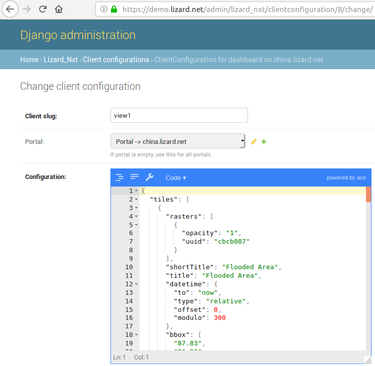

================================================================
Lizard-Tile-Dashboard Configuration and Parramatta-Configuration
================================================================

.. contents::
  :local:

------------
Introduction
------------

This is a fully configurable dashboard app.  
Users can define themselves what each dashboard will show and are able to define multiple dashboards with each their own url.  
Users will be able to do so in the "client_configuration" admin page of the lizard-nxt application: "/admin/lizard_nxt/clientconfiguration".  
Below screenshot is an example of such a record.  

  
- The "portal" field defines the base url of the dashboard  
- The "slug" field defines the postfix of the url  
- The configuration field defines the content of the dashboard and will be explained further under "The configuration field"  

The url to acces the configured dashboard always has the format:  
`<portal>/`dashboard`/<slug>`  
For legacy reasons there is an exception to this, namely:  
If the "slug" field has the value "dashboard" then the app can also be accessed via the url:  
`<portal>/`dashboard`/`  

The example in above screenshot would thus be accessable via the url:
`https://china.lizard.net/dashboard/view1 <https://china.lizard.net/dashboard/view1>`_

-----------------------
The configuration field
-----------------------

The "configuration" field defines the content of the dashboard in a `JSON format <https://www.json.org/>`_.  
A dashboard typically contains of: 

- meta-properties
- tiles, each tile is of one of the following types:

  - *map*: a geographical map, implemented in `Leaflet <https://leafletjs.com/>`_
  - *timeseries*: a temporal graph, implemented in `Plotly <https://plot.ly/javascript/>`_
  - *external*: other media type (image, gif, etc)

The JSON stored in the admin is hard to edit because all formatting is lost. It can be made neater with online tools like `https://jsoneditoronline.org/ <https://jsoneditoronline.org/>`_.

-----
Tiles
-----

Each dashboard can contain one or more tiles.  
Tiles are the little squares on the main page.  
Within the dashboard app, each tile has unique content and can be made fullscreen by clicking on it.  
Since there are multiple tiles per dashboards the tiles are defined in the JSON format with an `array <https://www.w3schools.com/js/js_json_arrays.asp>`_ of objects.
Each element of this tile array is itself a `JSON object <https://www.w3schools.com/js/js_json_objects.asp>`_ defining the content of the respective tile.  

Below is an example.   
CAUTION ! Please be aware that comments are not valid JSON and should be removed before using below example in real life.::

  "tiles": [
    { 
      // Example of a map tile
      "shortTitle": "Example of map tile",
      "title": "Example of map tile",
      "type": "map",
      "id": 1,
      "rasters": [
        {
          "opacity": "1",
          "uuid": "cbcb087"
        }
      ],
      "datetime": {
        "to": "now",
        "type": "relative",
        "offset": 0,
        "modulo": 300
      },
      "bbox": [
        "87.83",
        "26.92",
        "93.37",
        "21.82"
      ]
    },
    {
      // example of a timeseries tile
      "title": "Example timeseries tile",
      "type": "Example timeseries tile",
      "id": 17,
      "periodHoursRelativeToNow": [
        -7,
        3
      ],
      "legendStrings": [
        "Toongabbie water level"
      ],
      "colors": [
        "#26A7F1",
        "#000058"
      ],
      "timeseries": [
        "1b7843d"
      ],
      "legend": {
        "bgcolor": "rgba(255, 255, 255, 0.25)",
        "font": {
          "family": "Futura, monospace",
          "size": 17,
          "color": "purple"
        }
      }
    },
    {
      // example of a image tile
      "title": "Overzicht Twentekanaal Hoogeveense Vaart",
      "url": "https://ijgenzon.lizard.net/media/ijgenzon/Overzicht_TK_HV.png",
      "imageUrl": "https://ijgenzon.lizard.net/media/ijgenzon/Overzicht_TK_HV.png",
      "renderAsImage": true,
      "type": "external",
      "id": 15
    },
  ],

---------------
Meta-properties
---------------

Meta-properties define constants that are identical for all tiles on the dashboard.  
Some of these properties can only be defined as meta-properties, but others may also be defined per tile.  
In the latter case properties on tile-level will always take precedence over properties on meta-level.  
Properties that only exist on tile level and not on meta-level also exist and are in fact the majority.  

----------------
Tile dashboards:
----------------

Below is a non-exhaustive list of properties.  
Please help by extending this list.

Example
=======

**First an example:**
Below the example are the properties of the tile dashboards.

The table below is created with taking into account the reStructuredText way of creating tables.
Due to time constrictions, this is not done for all properties.

+-------------------+-------------------------+
|What it does       |Explanation              |
+-------------------+-------------------------+
|Format             |String/ Integer/ ..      |
+-------------------+-------------------------+
|Required           |Yes/ No                  |
+-------------------+-------------------------+
|Where it is defined|on root level of JSON/ ..|
+-------------------+-------------------------+

**Actual properties:**

Meta-properties
===============

tiles
-----
- What the tiles of the dashboard should show. See the next paragraph Tiles for what properties you can set for the Tiles.
- array of tile objects.
- Yes
- on root level of JSON (?)

Check the `Tile properties of Tile Dashboards`_.

periodHoursRelativeToNow
------------------------
- It sets the hours from now, with the amount of hours you can look into the past and the amount of hours you can see into the future.
- 2-element array of integers.
- No. If not set, the default is [-24, 12].
- on root level of JSON (?)

Tile properties of Tile Dashboards
==================================

id
--
- Must be unique for each tile. To track which is currently selected.
- integer
- Yes
- on root level of JSON

title
-----
- The full (long) title of the tile that will be shown on the fullscreen view of the tile.
- string
- Yes
- on root level of JSON

shortTitle
----------
- Will be used for the small versions of the tile if set, otherwise the normal title is used.
- string
- No
- on root level of JSON

type
----
- Type of the tile that decides the other fields below. Currently one of “map”, “timeseries”, “statistics” or “external”.
- string
- Yes
- on root level of JSON

viewInLizardLink
----------------
- If set then this is linked from the header above the fullscreen version of the tile.
- string
- No
- on root level of JSON

nowDateTimeUTC
--------------
- Defines the current time of the dashboard. If defined then gauge data will nog get updated
- For example 2018-10-29T10:00:00Z
- No, defaults to current date/time
- on root level of JSON 

isPublic
--------
- If true then the user does not need to login to open the dashboard
- true/false
- No, defaults to false
- on root level of JSON

type: map tile
==============

The map type tiles can show measuring stations, points and WMS layers, possibly of temporal rasters.

assetTypes
----------
- If set, all measurement stations in the map area are retrieved from the API and shown on the map.
- array of assets types, but currently only [“measuringstation”] actually works.
- No
- in map of JSON (?)

bbox
----
- The bounding box for the map.
- a 4-number array [westmost, southmost, eastmost, northmost] with WGS84 coordinates.
- No, default if not set, see config.js: [150.9476776123047, -33.87831497192377, 151.0842590332031, -33.76800155639643]
- in map of JSON (?)

datetime
--------
- Objects for relative time. Example:
  ::

    {
      “type”: “relative”,
      “to”: “now”,  // or “start” or “end” (of a timeseries)
      “offset”: 0, // Number of seconds before or after the “to” point
      “modulo”: 300 // Optional number of seconds, only works for to: “now”;
      // Current time is rounded down to a multiple of this many seconds.
      // Use so that the time only changes e.g. every five minutes.
    }

- Object
- No, optional for temporal rasters.
- in map of JSON (?)

points
------
- Points for point markers. Example:
  ::

    {
      “title”: “This is a point”,
      “geometry”: {
        “type”: “Point”,
        “coordinates”: […] // GeoJSON
      }
    }

- Array of objects.
- No
- in map of JSON (?)

rasters
-------
- Raster objects to show as WMS layers. Example:
  ::

    {
      “uuid”: string,  // UUID of the raster as in the API
      “opacity”: “0.5” // string with the opacity as a number
    }

- Array of raster objects.
- No
- in map of JSON (?)

wmsLayers
---------
- Array of extra wms layers. Example:
  ::

    {
      “layers”: “gauges”,
      “format”: “image/png”,
      “url”: “https://geoserver9.lizard.net/geoserver/parramatta/wms?SERVICE=WMS&REQUEST=GetMap&VERSION=1.1.1”,
      “height”: 256,
      “zindex”: 1004,
      “width”: 256,
      “srs”: “EPSG:3857”,
      “transparent”: true
    }

- Array.
- No
- in map of JSON (?)

type: timeseries tile
=====================

The timeseries type tiles are charts of timeseries, they can have two sources: intersections of a point geometry with a raster or timeseries objects from the API.

It’s not possible yet to set the color of charts of raster intersections, they are a few shades of blue at the moment.

timeseries
----------
- Timeseries UUIDs.
- Array of timeseries UUIDs.
- Yes
- in timeseries of JSON (?)

colors
------
- Color codes for each timeseries.
- Array of color codes for each timeseries.
- ?
- in timeseries of JSON (?)

rasterIntersections
-------------------
- Intersections with the keys *uuid* and *geometry*.
  ::

    {
      “uuid”: UUID of the raster,
      “geometry”: {
        “type”: “Point”,
        “coordinates”: [
          5.9223175048828125,
          52.15118665954508
        ]
      }
    }

- Array of objects with the keys shown above.
- ?
- in timeseries of JSON (?)

type: statistics tile
=====================

Nothing can be configured in a statistics type tile, so there should be exactly 1 of this tile type in the list.

The app just retrieves all the alarms that the user has access to, assumes they’re all relevant, and shows statistics on them.

type: external tile
===================

The external type tile is for external web pages (must be https, and may have headers that prevent us from using iframes, so not all pages work!).

imageUrl
--------
- Url of image to show in the tile.
- String.
- No, an icon is shown as default.
- in external of JSON (?)

url
---
- Web page to show in an iframe in the fullscreen version.
- String.
- No, nothing is shown as default.
- in external of JSON (?)

---------------------
Parramatta dashboard:
---------------------

Example
=======

**First an example:**
Below the example are the properties of the tile dashboards.

- What it does
- Format
- Required
- Where it is defined

**Actual properties:**

Meta-properties
===============

tiles
-----
- What the tiles of the dashboard should show. See the next paragraph Tiles for what properties you can set for the Tiles.
- Object
- Yes
- on root level of JSON (?)

Check the `Tile properties of Parramatta Dashboard`_.

Tile properties of Parramatta Dashboard
=======================================

id
--
- Must be unique for each tile. To track which is currently selected.
- integer
- Yes
- on root level of JSON

title
-----
- The full (long) title of the tile that will be shown on the fullscreen view of the tile.
- string
- Yes (?)
- on root level of JSON

shortTitle
----------
- Will be used for the small versions of the tile if set, otherwise the normal title is used.
- string
- No
- on root level of JSON

type
----
- Type of the tile that decides the other fields below. Currently one of “map”, “timeseries”, “statistics” or “external”.
- string
- Yes
- on root level of JSON

viewInLizardLink
----------------
- If set then this is linked from the header above the fullscreen version of the tile.
- string
- No
- on root level of JSON

refreshAutomatic
----------------
- If true, then dashboard will be refreshed as defined in refreshEveryMiliseconds
- true/false 
- No, defaults to false
- on root level of JSON

refreshEveryMiliseconds
-----------------------
- Amount miliseconds that dashboard gets refreshed. Works only if refreshAutomatic=true
- integer
- No, defaults to 300000
- on root level of JSON

type: map
=========

The map type tiles can show measuring stations, points and WMS layers, possibly of temporal rasters.

type: timeseries tile
=====================

The timeseries type tiles are charts of timeseries, they can have two sources: intersections of a point geometry with a raster or timeseries objects from the API.

It’s not possible yet to set the color of charts of raster intersections, they are a few shades of blue at the moment.

type: statistics tile
=====================

Nothing can be configured in a statistics type tile, so there should be exactly 1 of this tile type in the list.

The app just retrieves all the alarms that the user has access to, assumes they’re all relevant, and shows statistics on them.

type: external tile
===================

The external type tile is for external web pages (must be https, and may have headers that prevent us from using iframes, so not all pages work!).

In this folder, some examples are shown for the client configuration in the admin.
The jsons in this folder contain the code per example mentioned below.

Timelines and backgroundColorShapes
===================================

- example-with-timelines-and-backgroundcolorshapes.json

To add timelines to a type: timeseries tile, you can add the following to this tile:
All the properties (epochTimeInMilliSeconds, color, lineDash, text, isRelativeTimeFromNow) are mandatory to configure a timeline.
The time must be set in milliseconds. The time can be set relative from now (by setting isRelativeTimeFromNow to true and epochTimeInMilliSeconds to the time you want it to be relatiive from now, either a positive or negative number). The time can also be set absolute. In this case, isRelativeTimeFromNow should be set to false and epochTimeInMilliSeconds should be set to the epoch time in milliseconds.::

  "timelines": [
    {
      "epochTimeInMilliSeconds": 0,
      "color": "#C0392B",
      "lineDash": "dot",
      "text": "NOW",
      "isRelativeTimeFromNow": true
    },
    {
      "epochTimeInMilliSeconds": 7200000,
      "color": "#FFC850",
      "lineDash": "dot",
      "text": "NOW+2 hour",
      "isRelativeTimeFromNow": true
    },
    {
      "epochTimeInMilliSeconds": 43200000,
      "color": "#16A085",
      "lineDash": "dot",
      "text": "NOW+12 hour",
      "isRelativeTimeFromNow": true
    },
    {
      "epochTimeInMilliSeconds": 1550270003000,
      "color": "#BABABA",
      "lineDash": "dot",
      "text": "Absolute timeline",
      "isRelativeTimeFromNow": false
    }
  ]

To add backgroundColorShapes (that create a background color) to a type: timeseries tile, you can add the following to this tile:
All the properties (x1EpochTimeInMilliSeconds, x2EpochTimeInMilliSeconds, color, opacity, isRelativeTimeFromNow) are mandatory to configure a backgroundColorShape.
Like with the timelines, the time must be set in milliseconds. The time can be set relative from now (by setting isRelativeTimeFromNow to true and epochTimeInMilliSeconds to the time you want it to be relatiive from now, either a positive or negative number). The time can also be set absolute. In this case, isRelativeTimeFromNow should be set to false and epochTimeInMilliSeconds should be set to the epoch time in milliseconds.::

  "backgroundColorShapes": [
    {
      "x1EpochTimeInMilliSeconds": 0,
      "x2EpochTimeInMilliSeconds": 7200000,
      "color": "#FFC850",
      "opacity": "0.5",
      "isRelativeTimeFromNow": true
    },
    {
      "x1EpochTimeInMilliSeconds": 7200000,
      "x2EpochTimeInMilliSeconds": 43200000,
      "color": "#FFF082",
      "opacity": "0.5",
      "isRelativeTimeFromNow": true
    },
    {
      "x1EpochTimeInMilliSeconds": 1550237003000,
      "x2EpochTimeInMilliSeconds": 1550270003000,
      "color": "#BABABA",
      "opacity": "0.5",
      "isRelativeTimeFromNow": false
    }
  ]

If you want a backgroundColorShape with a line to the right of it, you should create a timeline on that moment in time.

Legend
======

**Legend (timeseries)**

* example-with-legend.json
* example-with-legend-show-possibilities.json

The legend for timeseries tiles can also be configured.

Below shows an example of what to add to the configuration of a timeseries tile for a legend that is white with 0.25 opacity::

  "legend": {
    "bgcolor": "rgba(255, 255, 255, 0.25)"
  }

But there are more possibilities. Below are the possibilities for legend configuration. Add them to a timeseries tile. All possibilities are optional.::

  "legend": {
    "x": 5,
    "xanchor": "right",
    "y": "0.5",
    "yanchor": "top",
    "bgcolor": "rgba(22, 160, 133, 0.25)",
    "bordercolor": "rgba(22, 160, 133, 1)",
    "borderwidth": 3,
    "font": {
      "family": "Futura, monospace",
      "size": 17,
      "color": "purple"
    },
    "orientation": "h",
    "traceorder": "reversed",
    "tracegroupgap": 20,
    "uirevision": "",
    "valign": "top"
  }

**Legend (map)**

The legend of the map can also be configured.
To configure the opacity of this legend, add an opacity to the configuration of an tile with type map, like below::

  "opacity": 0.8
